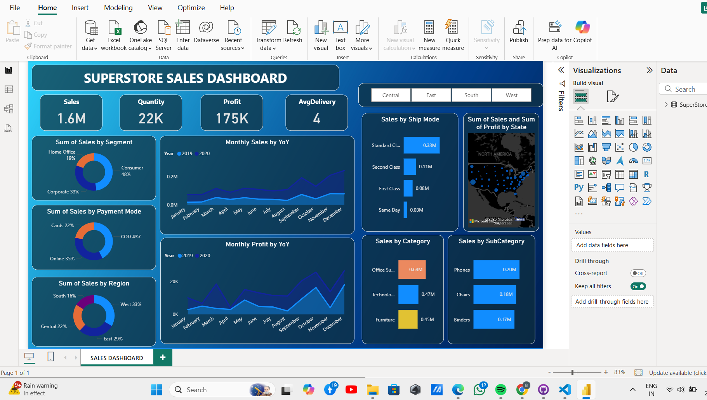

# FUTURE_INTERN_DS_01
Interactive Business Sales Dashboard built with Power BI using E-commerce data.
# 📊 Sales Dashboard (Power BI)

## 📌 Project Overview
This repository contains an interactive Sales Dashboard built using Power BI.  
The dashboard provides insights into sales performance, revenue trends, top products, customer segmentation, and other key business metrics.  

The goal of this project is to:
- Analyze sales data in a structured way  
- Provide dynamic reports for decision-making  
- Highlight trends and KPIs with easy-to-read visuals  

---

## ⚡ Features
- 📈 **Revenue & Profit Trends** – Track sales performance over time  
- 🛍 **Top Products & Categories** – Identify best-selling items  
- 🌍 **Regional Analysis** – Compare sales across different regions  
- 👥 **Customer Insights** – Understand customer behavior  
- 🔄 **Interactive Filters** – Drill down by time, product, and region  

---

## 🛠 Tools & Technologies
- **Power BI** – Dashboard creation & visualization  
- **Excel / CSV Dataset** – Data source (pre-processed for analysis)  

---

## 🚀 How to Use
1. Clone this repository:
   ```bash
   git clone https://github.com/your-username/sales-dashboard.git
   ```
2. Open the `.pbix` file using **Power BI Desktop**.  
3. Explore the dashboard using slicers, filters, and drill-through features.  

---

## 📷 Dashboard Preview

  


---

## 📑 Insights
Some key insights from the dashboard:
- Seasonal sales peaks identified in specific months  
- Certain regions outperform others consistently  
- Top 10 products contribute to the majority of revenue  

---

## 📌 Future Improvements
- Add predictive analytics (forecasting sales trends)  
- Integrate live data source (SQL/Cloud)  
- Build a web-embedded version of the dashboard  

---

## 👩‍💻 Author
Priyanka Manral
📧 [priyankamanral68@gmail.com].  
🔗 [LinkedIn](www.linkedin.com/in/priyankamanral26)  
